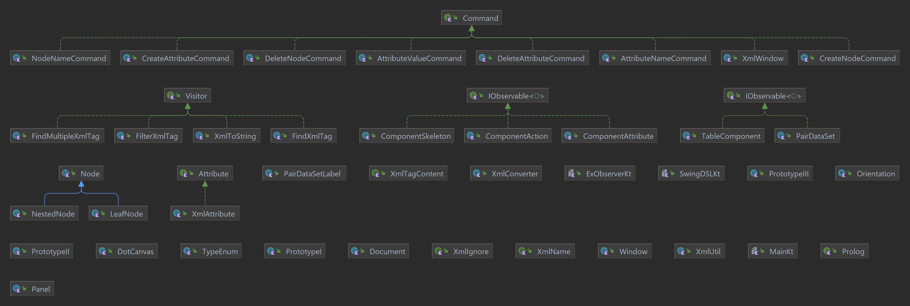

# XML Library

---


---


---
# Structure



Nesta library é possivel encontrar tanto objectos que representam o xml (Node, NestedNode, LeafNode, Prolog e Document), como também funções basicas para encontrar elementos (FindMultipleXmlTag, FindXmlTag e FilterXmlTag) ou criar representações textuais do mesmo (XmlToString), ou seja, um ficheiro xml. 

## Xml Object To String

```kotlin
val root: Node = NestedNode("entity", mutableListOf(), mutableListOf())
val xmlToString = XmlToString()
root.accept(xmlToString)
println(xmlToString)
```

## Find multiple elements

```kotlin
val root: Node = NestedNode("text", mutableListOf(), mutableListOf())
val textFindXmlTag = FindMultipleXmlTag { it.name == "text" }
root.accept(textFindXmlTag)
println(textFindXmlTag.nodes)
```

## Filter elements (create a new obj/doc)

```kotlin
val root: Node = NestedNode("entity", mutableListOf(), mutableListOf())
val predicate: (Node) -> Boolean = {it.name == "text" || it.name == "entity" }
val filterDocument = FilterXmlTag(predicate)
root.accept(filterDocument)
println(filterDocument.root)
```

## Criação de objs de xml
Nesta library ainda é possivel usar anotações para criação de objectos xml.
As anotações que auxiliam nessa acção são: [@XmlIgnore](src/main/kotlin/annotations/XmlIgnore.kt),[@XmlTagContent](src/main/kotlin/annotations/XmlTagContent.kt) e [@XmlName](src/main/kotlin/annotations/XmlName.kt)

### Regras consideradas nesta library

* 1- Para todos os objectos a class é a entidade
* 2- Só pode haver uma @XmlTagContent dentro da class, tudo o resto sera ignorado
* 3- Se não tiver qualquer anotação por default o nome da property é o nome do elemento
* 4- O XmlName da override a esse nome
* 5- O XmlIgnore ignora o item
* 6- O XmlTagContent indica que é o unico conteudo daquela class

## Converter from Object to XML Object
```kotlin
val prototypeI = PrototypeI()
val convertedObject = XmlConverter.convertObject(prototypeI)
```

## APP de XML 

Pode encontrar uma app para construção de XML e guardar num ficheiro. Para a construcao dessa APP foram usados padros de desenho nomeadamente command e obvervable
